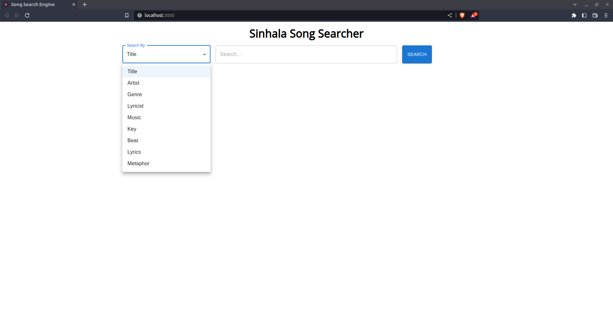
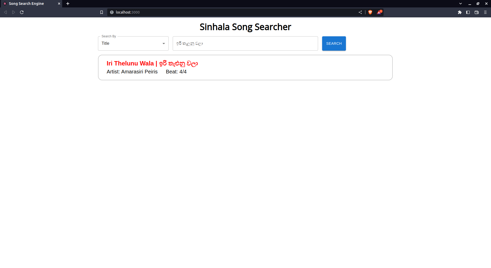
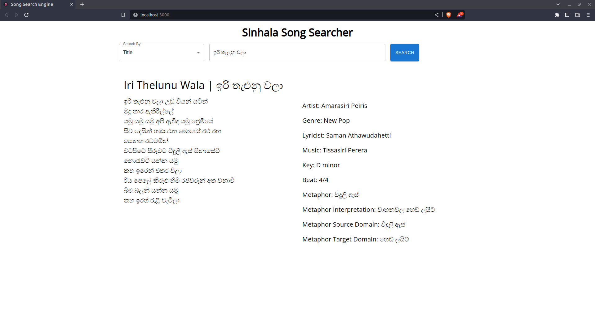

# Sinhala Song Search Application

This application is done as a project for the Semester 7, CS4642 - Data Mining & Information Retrieval module under the Department of Computer Science and Engineering, University of Moratuwa.

## Table of Content

1. [Corpus Creation](#corpus-creation).
2. [Information Retrieval System using `elasticsearch`](#information-retrieval-system).
3. [Frontend and Backend of the system](#frontend-and-backend-of-the-system).
4. [System Setup](#system-setup)

### Corpus Creation

The corpus used for the application was created using python's web crawling framework [`Scrapy`](https://scrapy.org/). Following are some key points of the corpus creation.

1. Song information Collection.
   - [https://www.sinhalasongbook.com/](https://www.sinhalasongbook.com/) was used to crawl song data.
2. Song data were crawled using `Scrapy` as mentioned above.
   - Songs sung by `Amaradewa`, `Amarasiri Peiris`, `Edward Jayakody`, `Gunadasa Kapuge`, `Karunarathna Divulgane`, `Nanda Malani`, `Sanath Nandasiri`, `Sunil Edirisinghe`, `TM Jayarathna`, `Victor Rathnayaka` were selected to be crawled.
   - A maximum of 15 songs by each (a total of 150 songs were collected) artist were collected to create the initial corpus.
   - Each crawled item contained information about the `title`, `artist`, `genre`, `lyricist`, `music`, `key`, `beat`, `lyrics` of the song.
3. Adding metaphor data.
   - Using the 150 songs obtained, 100 songs were selected by adding metaphors data manually for each seleted song.
   - Metaphor related fields added: `metaphor`, `metaphor interpretation`, `metaphore source domain`, `metaphore target domain`.
4. Creating the corpus.
   - Using the formatted song details, a song corpus in `csv` format was created ([songs_formatted.csv](outputs/corpus/songs_formatted.csv)) and using it the indexable song data file ([song_data.json](elasticsearch/song_data.json)) was created.

### Information Retrieval System

After completing the song corpus, next the information retrieval system for sinhala songs were created using [`elasticsearch`](https://www.elastic.co/). [`Node.js elasticsearch client`](https://www.npmjs.com/package/@elastic/elasticsearch) was used for elasticsearch operations. Following are some important functionalities of the Information Retrieval System.

1. Analyzers:

   - `sinhala_language_analyzer`: A custom analyzer created for analyzing `sinhala` words. [`icu_tokenizer`](https://www.elastic.co/guide/en/elasticsearch/plugins/current/analysis-icu-tokenizer.html) plugin was seleted as the `tokenizer` which supports asian languages.
   - `case_insensitive_analyzer`: A custom analyzer created for analyzing `english` words by normalizing every character into `lowercase` characters.

2. Filters:

   - `stop word filters`: Custom stop word filters related to different sinhala searching fields (`song`, `artist`, `lyricist`, `other`) were created ([reference](backend/elastic_indexer.js)).
   - `sinhala n gram`: Edge N Gram filter was created with a `max_gram` of 10 and `min_gram` of 2.

3. Mappings:
   - After creating the custom analyzers and filters, mappings for each field were created.

After completing the above steps, using the `Node.js elasticsearch client` mappings and document indexes were created.

Searching queries are created using a `bool` query ([reference](backend/index.js)) according to the information provided at the song search (by which filter the search is done).

### Frontend and Backend of the System

Backend of the System was created using `Node.js` and `express` package. `React` was used to create the fronend. Below is few snapshots of the system.

#### Landing Page



#### Song Search with Results



#### Song Details



### System Setup

#### Setting up the elasticsearch server

1. If you don't have elasticsearch on your computer please [download](https://www.elastic.co/downloads/elasticsearch) and install.
2. Then setup the elasticsearch server on the `9200` port (the default elasticsearch server port) with privilege permissions (without setting security will work).
3. [Optional] In case security is setup, update the `Node.js elasticsearch client` with the neccessary keys.
4. Execute the following commands from the project root to create mappings and indexes for the IR system.
   ```bash
    cd backend
    node elastic_indexer.js
   ```

#### Setting up the backend and frontend

1. After completing the [above](#setting-up-the-elasticsearch-server) process, start the backend on port `3001` using the following commands from the project root.
   ```bash
    cd backend
    node index.js
   ```
2. Frontend can be started using the following commands from the project root.
   ```bash
    cd frontend
    npm start
   ```
